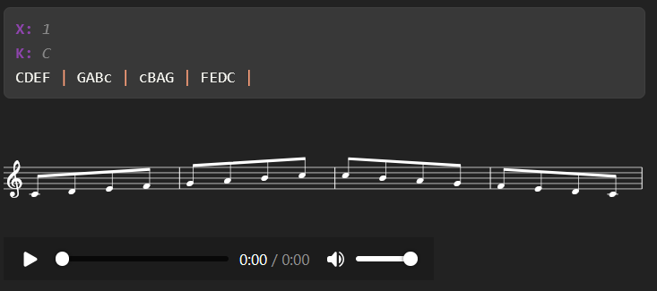

<p align="center">
  
</p>

# Musify: Quarto Extension for Music Notation

Musify is a [Quarto](https://quarto.org/) extension that allows you to embed high-quality, interactive music notation and synthesized audio directly into your documents using [ABC notation](https://abcnotation.com/).

It compiles ABC code blocks into:
* 🎼 **Visual Sheet Music**: Scalable Vector Graphics (SVG) using `abc2svg` / `abcnode`.
* 🔊 **Audio Playback**: WebM audio files synthesized via `abc2midi`, `fluidsynth`, and `ffmpeg`.

---

## Features

* **Cross-Platform Support**: Fully compatible out-of-the-box on Windows, macOS, and Linux.
* **Integrated Audio Player**: Automatically generates and embeds an HTML5 audio controller inline.
* **SoundFont Synthesis**: Re-renders MIDI files into rich audio using Fluidsynth and high-quality SoundFonts.
* **Flexible Customization**: Configure global options in `_quarto.yml` or override settings per-block.
* **Cached Builds**: Only regenerates assets when the ABC source code changes, speeding up document compiles.

---

## Demo Showcase

Here is an example of the compiled visual sheet music and interactive audio controller:




[👉 View Live Interactive Demo Page](https://sebastiandelbanorollin.github.io/musify/)

---

## Installation

To add the extension to your Quarto project, run the following command in your terminal:

```bash
quarto add sebastiandelbanorollin/musify
```

---

## System Dependencies

Musify relies on several external utilities to render sheets and synthesize audio:

1. **`abc2svg` (or `abcnode`)**: For converting ABC notation into SVG vector graphics.
2. **`abc2midi`**: For converting ABC files into MIDI sequences (often packaged as `abcmidi`).
3. **`fluidsynth`**: For synthesizing MIDI sequences into high-quality WAV audio.
4. **`ffmpeg`**: For converting WAV audio into WebM format for browser playback.
5. **Python 3**: Used for backend execution.

### SoundFont Setup
Audio synthesis requires a SoundFont file (e.g. *Timbres of Heaven*). By default, Musify searches for the SoundFont file at the local user path:
* **Windows**: `%USERPROFILE%\.local\share\soundfonts\timbresOfHeaven4.00.sf2`
* **Linux/macOS**: `~/.local/share/soundfonts/timbresOfHeaven4.00.sf2`

If you have placed your SoundFont elsewhere, you can configure it globally in `_quarto.yml` or your environment variables:

```yaml
musify:
  sf2-path: "/path/to/your/font.sf2"
```
*(Alternatively, define the environment variable `MUSIFY_SF2_PATH` pointing to the `.sf2` file).*

---

## Usage

Enable the filter by adding `sebastiandelbanorollin/musify` to your document's
frontmatter, and use `{.abc}` code blocks:

```markdown
---
title: "My Music Sheet"
filters:
  - sebastiandelbanorollin/musify
---

## Example Piece

```{.abc scoreName="CMajorScale" visual="true" audio="true" fig-cap="A simple scale"}
X: 1
K: C
CDEF | GABc | cBAG | FEDC |
```

### Code Block Options

| Attribute | Description | Default |
|-----------|-------------|---------|
| `scoreName` | Unique base name for generated image/audio files | SHA1 hash of code |
| `visual` | Enable visual sheet music generation (SVG) | `false` |
| `audio` | Enable audio playback generation (WebM) | `false` |
| `fig-cap` | Caption text for the sheet music figure | `""` |
| `image-dir` | Directory path where SVGs are saved | `cache/images` |
| `audio-dir` | Directory path where WebMs are saved | `cache/audio` |
| `options` | Extra layout options passed directly to `abc2svg` | `--musicfont Bravura` |

---

## Global Configuration

You can set global default commands and directory paths in `_quarto.yml`:

```yaml
musify:
  image-dir: "cache/images"
  audio-dir: "cache/audio"
  bin-abc2svg: "abc2svg"     # Path or command for abc2svg
  bin-abc2midi: "abc2midi"   # Path or command for abc2midi
  bin-fluidsynth: "fluidsynth"
  bin-ffmpeg: "ffmpeg"
  sf2-path: "~/.local/share/soundfonts/timbresOfHeaven4.00.sf2"
```

---

## License

This project is licensed under the [MIT License](LICENSE).
